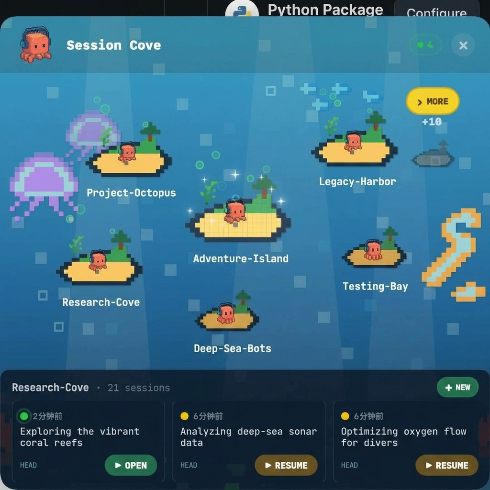

<h1 align="center">
  <br>
  
  <br>
  Session Cove
  <br>
</h1>

<p align="center"><b>Manage all your Claude Code sessions from a pixel harbor in the menu bar.</b></p>

<p align="center">
  <a href="#features">Features</a> &bull;
  <a href="#how-it-works">How It Works</a> &bull;
  <a href="#installation">Installation</a> &bull;
  <a href="#supported-tools">Supported Tools</a> &bull;
  <a href="#build-from-source">Build</a>
</p>

<p align="center">
  
  
  
</p>

<p align="center">
  
</p>

---

## What is Session Cove?

When you use Claude Code across many projects, sessions scatter across directories and terminals. You forget what you worked on yesterday, can't find that debugging session from last week, and lose context switching between projects.

**Session Cove** gives you a bird's-eye harbor map of every Claude Code session — past and present — grouped by project as pixel islands. Browse history, resume any session with one click, and approve permission requests without leaving your workflow.

> Think of it as a save-file manager for your AI pair programming — like the dive log in Dave the Diver, but for code sessions.

## Features

- **Session history management** — Browse, search, and resume any past Claude Code session across all projects. Never lose a conversation again.
- **Harbor map visualization** — Each project is a pixel island; active sessions glow with bubbles and seaweed animations, archived ones rest quietly.
- **One-click resume** — Select any historical session and reopen it in your terminal with the correct working directory.
- **Permission approval** — Intercept Claude Code's permission requests and approve/deny/always-allow from the menu bar — no terminal switching needed.
- **Always Allow rules** — One tap to permanently approve a tool type per project. The hook auto-responds on future requests silently.
- **Real-time session detection** — Discovers new sessions and status changes via filesystem events. Active, recent, and archived states update live.
- **Ocean sound effects** — Sonar pings for permission requests, bubble pops for actions, water splashes for transitions. 8-bit Dave the Diver vibes.
- **Pixel art mascot** — A diving octopus companion that reacts to session state: working, idle, sleeping, or attention-needed.

## How It Works

```text
~/.claude/projects/          Session Cove
┌──────────────────┐        ┌─────────────────────────┐
│ project-a/       │        │  ┌───┐  ┌───┐  ┌───┐   │
│   session1.jsonl │───────▶│  │ 🏝 │  │ 🏝 │  │ 🏝 │   │
│   session2.jsonl │        │  └───┘  └───┘  └───┘   │
│ project-b/       │        │     Harbor Map View     │
│   session3.jsonl │        └─────────────────────────┘
└──────────────────┘                   │
                                       ▼
~/.claude/settings.json     ┌─────────────────────────┐
┌──────────────────┐        │  Permission Ping Card   │
│ hooks:           │        │  [Allow] [Always] [Deny]│
│  PermissionReq…  │◀──────│                         │
└──────────────────┘        └─────────────────────────┘
```

Session Cove reads session metadata from `~/.claude/projects/` (headers only — never full transcripts). It registers a `PermissionRequest` hook in Claude Code's settings to intercept approval prompts via a lightweight Python bridge script.

## Supported Tools

| AI Client | Status | Notes |
|-----------|--------|-------|
| Claude Code | Supported | Full integration: sessions, permissions, resume |

| Terminal | Status | Notes |
|---------|--------|-------|
| iTerm2 | Supported | Session resume via `claude --resume` |
| Terminal.app | Planned | |
| Ghostty | Planned | |

<a id="installation"></a>

## Installation

### One-line Install

```bash
git clone https://github.com/koersliven/Session-cove.git && cd Session-cove && ./install.sh
```

This will build from source, create an `.app` bundle, and install to `/Applications`.

### Homebrew (coming soon)

```bash
brew install --cask session-cove
```

### Download

Check [Releases](https://github.com/koersliven/Session-cove/releases) for the latest `.dmg`.

<a id="build-from-source"></a>

### Build from Source

```bash
git clone https://github.com/koersliven/Session-cove.git
cd Session-cove
swift build -c release
```

The built binary is at `.build/release/SessionCove`. To create an `.app` bundle:

```bash
./scripts/bundle.sh
open ".build/release/Session Cove.app"
```

## Requirements

- macOS 14.0 (Sonoma) or later
- Claude Code installed
- iTerm2 (for session resume)

## Acknowledgments

Inspired by [Ping Island](https://github.com/erha19/ping-island) — the original AI coding session monitor for macOS notch. Session Cove takes a different approach: focusing on **session history management** and a **multi-project harbor map** rather than single-session attention tracking.

## License

MIT
