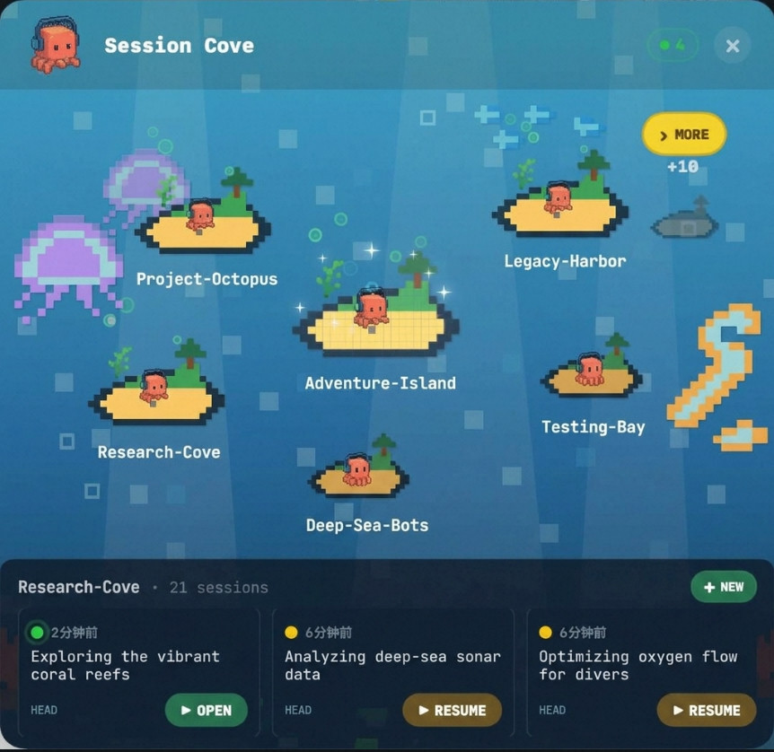
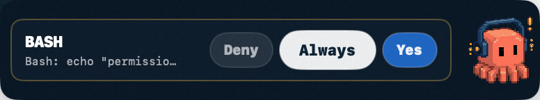
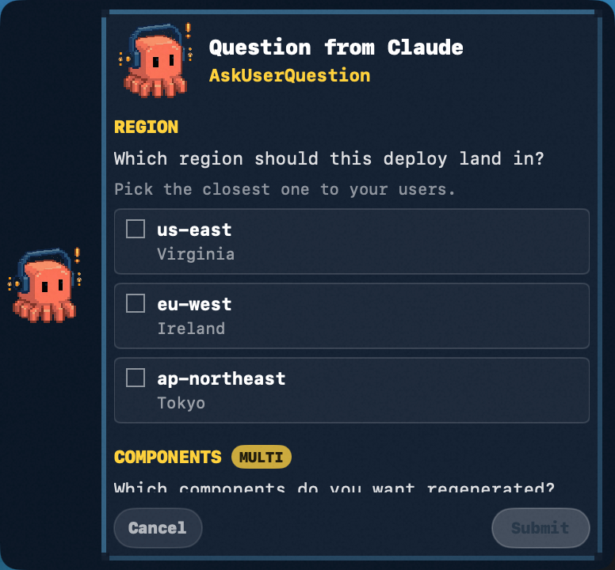

<h1 align="center">
  <br>
  
  <br>
  Session Cove
  <br>
</h1>

<p align="center"><b>Manage all your Claude Code sessions from a pixel harbor in the menu bar.</b></p>

<p align="center">
  <a href="#features">Features</a> &bull;
  <a href="#how-it-works">How It Works</a> &bull;
  <a href="#installation">Installation</a> &bull;
  <a href="#supported-frameworks">Supported Frameworks</a> &bull;
  <a href="#build-from-source">Build</a>
</p>

<p align="center">
  
  
  
</p>

<p align="center">
  
</p>

<p align="center">
  
</p>

<p align="center">
  
  <br>
  <em>When Claude calls <code>AskUserQuestion</code>, Session Cove surfaces a pixel form so you can pick from options or type a free answer — without switching to the terminal.</em>
</p>

---

## What is Session Cove?

When you use Claude Code across many projects, sessions scatter across directories and terminals. You forget what you worked on yesterday, can't find that debugging session from last week, and lose context switching between projects.

**Session Cove** gives you a bird's-eye harbor map of every Claude Code session — past and present — grouped by project as pixel islands. Browse history, resume any session with one click, and approve permission requests without leaving your workflow.

> Think of it as a save-file manager for your AI pair programming — like the dive log in Dave the Diver, but for code sessions.

## Features

- **Session history management** — Browse, search, and resume any past Claude Code session across all projects. Never lose a conversation again.
- **Harbor map visualization** — Each project is a pixel island; active sessions glow with bubbles and seaweed animations, archived ones rest quietly.
- **One-click resume** — Select any historical session and reopen it in your terminal with the correct working directory.
- **Permission approval** — Intercept Claude Code's permission requests and approve/deny/always-allow from the menu bar — no terminal switching needed.
- **Interactive question forms** — When Claude calls `AskUserQuestion` (single-choice / multi-choice / free text / secret token), Session Cove pops a pixel form right under the notch. Submit your answer and Claude continues — you never have to focus the terminal mid-thought.
- **Always Allow rules** — One tap to permanently approve a tool type per project. The hook auto-responds on future requests silently.
- **Real-time session detection** — Discovers new sessions and status changes via filesystem events. Active, recent, and archived states update live.
- **Ocean sound effects** — Sonar pings for permission requests, bubble pops for actions, water splashes for transitions. 8-bit Dave the Diver vibes.
- **Pixel art mascot** — A diving octopus companion that reacts to session state: working, idle, sleeping, or attention-needed.

## How It Works

```text
~/.claude/projects/          Session Cove
┌──────────────────┐        ┌─────────────────────────┐
│ project-a/       │        │  ┌───┐  ┌───┐  ┌───┐   │
│   session1.jsonl │───────▶│  │ 🏝 │  │ 🏝 │  │ 🏝 │   │
│   session2.jsonl │        │  └───┘  └───┘  └───┘   │
│ project-b/       │        │     Harbor Map View     │
│   session3.jsonl │        └─────────────────────────┘
└──────────────────┘                   │
                                       ▼
~/.claude/settings.json     ┌─────────────────────────┐
┌──────────────────┐        │  Permission Ping Card   │
│ hooks:           │        │  [Allow] [Always] [Deny]│
│  PermissionReq…  │◀──────│                         │
└──────────────────┘        └─────────────────────────┘
```

Session Cove reads session metadata from `~/.claude/projects/` (headers only — never full transcripts). It registers a `PermissionRequest` / `PreToolUse` / `Stop` hook in Claude Code's settings to intercept approval prompts, route `AskUserQuestion` answers, and surface turn-completion toasts — all through a single lightweight Python bridge script.

### Multiple AI agent frameworks

Session Cove now ships with an `AgentProvider` abstraction that lets it manage sessions and hooks for several Claude-compatible coding agents — not just Claude Code. The bridge script accepts a `--provider <id>` argument and emits the right hook-output dialect for each framework.

By default **only Claude Code is enabled** on first launch. Open **Settings → AI 框架** to toggle Qoder / QoderWork / Cursor — each toggle writes (or removes) that framework's settings file under `~/.qoder/`, `~/.qoderwork/`, or `~/.cursor/`. Disabled frameworks never see Session Cove touch their config.

<a id="supported-frameworks"></a>

## Supported Frameworks

| Framework | Status | Settings file | Coverage |
|-----------|--------|---------------|----------|
| Claude Code | Full | `~/.claude/settings.json` | `PermissionRequest` + `AskUserQuestion` + `Stop` + terminal focus |
| Qoder | Full | `~/.qoder/settings.json` | Claude-shaped hooks, alias dialect (PermissionRequest + AskUserQuestion + Stop) |
| QoderWork | Full | `~/.qoderwork/settings.json` | Claude-shaped hooks, alias dialect (PermissionRequest + AskUserQuestion + Stop) |
| Cursor | Experimental | `~/.cursor/hooks.json` | `Stop`-only — Cursor has no `PermissionRequest` equivalent today |

Toggle any of these in **Settings → AI 框架**. The status dot next to each framework reflects whether its settings file currently contains the Session Cove hook command.

### Supported Terminals

| Terminal | Focus existing | Launch new | Notes |
|---------|----------------|------------|-------|
| iTerm2 | ✅ AppleScript `tty` match | ✅ `do script` | Golden path |
| Terminal.app | ✅ AppleScript `tty` match | ✅ `do script` | Built-in fallback |
| Ghostty | ❌ no scripting | ✅ `open -na --args` | Launch only |
| kitty | ✅ `kitty @ ls / focus-window` | ✅ `kitty --directory` | Needs `allow_remote_control yes` |
| WezTerm | ✅ `wezterm cli list / activate-pane` | ✅ `wezterm cli spawn` | Multiplexer auto-starts |
| Alacritty | ❌ no scripting | ✅ `alacritty -e` | Launch only |
| Warp | ❌ closed scripting | ⚠️ falls back to Terminal.app | URL scheme can't carry commands |

The active terminal is auto-detected from the ancestor process of running `claude` instances; you can override it in **Settings → 通用 → 首选终端**.

<a id="installation"></a>

## Installation

### One-line Install

```bash
git clone https://github.com/koersliven/Session-cove.git && cd Session-cove && ./install.sh
```

This will build from source, create an `.app` bundle, and install to `/Applications`.

### Homebrew (coming soon)

```bash
brew install --cask session-cove
```

### Download

Check [Releases](https://github.com/koersliven/Session-cove/releases) for the latest `.dmg`.

<a id="build-from-source"></a>

### Build from Source

```bash
git clone https://github.com/koersliven/Session-cove.git
cd Session-cove
swift build -c release
```

The built binary is at `.build/release/SessionCove`. To create an `.app` bundle:

```bash
./scripts/bundle.sh
open ".build/release/Session Cove.app"
```

## Requirements

- macOS 14.0 (Sonoma) or later
- Claude Code installed
- iTerm2 (for session resume)

## Setup & Permissions

First launch requires two one-time approvals:

### 1. Gatekeeper (unsigned app)

Since Session Cove is not notarized by Apple, macOS will block the first launch:

1. Open **System Settings → Privacy & Security**
2. Scroll down to find _"Session Cove" was blocked from use because it is not from an identified developer_
3. Click **Open Anyway**

Or via terminal:
```bash
xattr -cr /Applications/Session\ Cove.app
```

### 2. Automation (iTerm2 control)

When you first resume or open a session, macOS will ask:

> _"Session Cove" wants to control "iTerm2"_

Click **OK**. This allows Session Cove to open new terminal windows and send `claude --resume` commands.

You can manage this later in **System Settings → Privacy & Security → Automation**.

### 3. Hook Installation (automatic)

On first launch, Session Cove automatically:
- Creates `~/.session-cove/hooks/` for the permission bridge (shared by every enabled framework)
- Adds `PermissionRequest`, `PreToolUse` (AskUserQuestion), and `Stop` hook entries to `~/.claude/settings.json`
- A backup of your original settings is saved as `settings.session-cove-backup.json`

No manual action needed — just restart any running Claude Code session to pick up the hook.

To enable Qoder / QoderWork / Cursor, toggle them in **Settings → AI 框架**. Session Cove will install (or uninstall) the equivalent hook entries in that framework's settings file on toggle, with the same backup-once safety net.

## Acknowledgments

Inspired by [Ping Island](https://github.com/erha19/ping-island) — the original AI coding session monitor for macOS notch. Session Cove takes a different approach: focusing on **session history management** and a **multi-project harbor map** rather than single-session attention tracking.

## License

MIT
